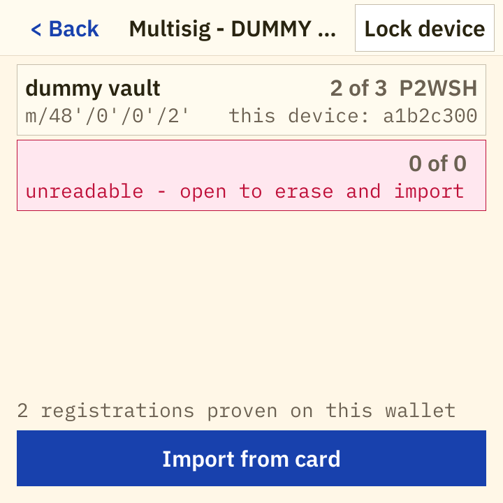

# notyas

Airgapped Bitcoin firmware for ESP32-P4 touch-display boards. You roll physical dice or
type an existing mnemonic, and the device derives a BIP-39 seed and the public key
material under it. On a board whose eFuse device key has been provisioned you can also set
a PIN, seal a wallet into flash so it is still there after a power cycle, register a
multisig wallet, and load a PSBT off a microSD card, review it and sign it from the panel.

No radio, no network stack and no USB data path are compiled into the image, and the
transaction path is a microSD card rather than a cable. What that does and does not buy on
this silicon is the first section below, not a footnote. Free software under the GNU GPL,
version 3 or later.


---

## Status and safety - read this first

**0.2.0 is a preview for testing. Do not put real funds behind a seed generated by this
firmware.**

- No independent security audit has been performed on this code. None is claimed.
- **No Secure Boot v2, no flash encryption, no JTAG or download-mode lockdown.** The one
  eFuse this release burns is the HMAC key the sealed storage binds to. An attacker who
  gets the device powered with a USB cable attached can halt the cores over the
  USB-Serial-JTAG peripheral or rewrite the app partition through ROM download mode.
  [docs/SECURITY.md](docs/SECURITY.md) states this in full under "The powered device"; it
  is the cheapest attack on this hardware and nothing in this release closes it.
- Because nothing on the device checks the firmware, **every value the Verify screen shows
  is the running firmware reporting on itself.** That is useful for detecting corruption
  and for comparing a unit against a digest you produced yourself; it cannot prove the
  firmware is the firmware you think it is. See "The self-reporting boundary" in
  docs/SECURITY.md.
- The firmware has been exercised on exactly two boards. Every other row of the board
  table is a source-verified scaffold that has never run on hardware.
- **The on-device signing loop has never been driven from a touch panel.** The screens, the
  card subsystem and the signing engine are wired together for real in
  `firmware/src/flow/mod.rs` and covered by host tests; nobody has yet sat in front of a
  device and taken a PSBT from card to signature that way. What has run on hardware is the
  same engine driven through the development console, on a board that is not
  eFuse-provisioned (`docs/clause2-evidence.md`). The third list in the next section says
  exactly which parts that leaves unproven.
- The dev boards ship with Secure Boot and flash encryption off. The Verify screen reports
  their true state; it does not pretend they are on.

Use it against testnet, against published test vectors, and against a seed you are
prepared to throw away.

## What a 0.2.0 unit does, does not, and has not been proven to do

Three lists rather than two. The third one exists because "the code is written, wired and
host-tested" and "someone has watched it work on a device" are different claims, and only
the second is evidence.

### Reachable from the panel, in a build with no development features

- **Dice entry** with a running effective-bits count and roll history, in six modes: RAW
  (variable-length prefix-free code) and fixed 12/15/18/21/24-word.
- **Mnemonic display** behind a two-step reveal gate, masked by default, followed by a
  word-by-word backup check before anything else is offered.
- **Restore by typing a mnemonic**, with BIP-39 autocomplete, a checksum verdict and a
  final-word helper.
- **Optional BIP-39 passphrase**, with an explicit opt-in, a Show/Hide toggle and an NFKD
  byte counter. It is never stored and never leaves the screen that took it.
- **BIP-32/44/48/49/84/86 derivation**: account xpub, SLIP-132 form where the scheme has
  one, and the first receive addresses.
- **QR export of public values only** - receive addresses and account xpub/SLIP-132.
- **Set a first PIN and seal a wallet**, on a provisioned board: the create flow offers
  keep-in-session or save, the save path formats the sealed store under a PIN typed twice
  (`crates/notyas-ui/src/screens/fork.rs` and `setpin.rs` raise `UiRequest::SetPin`,
  answered by `answer_set_pin` at `firmware/src/main.rs:1263`), and the wallet is sealed
  into the lowest free slot (`answer_persist_wallet`).
- **Unlock and open a stored wallet** after a power cycle, with anti-phishing words at
  half-PIN entry derived from the eFuse key, an attempt counter, and a wallet list
  (`answer_unseal`, `answer_open_wallet`).
- **Mount and browse a microSD card**, from the sign-source screen and the multisig import
  screen: a bounded catalog, directories, and a file picker that never looks inside a file
  (`UiRequest::ListCard` -> `flow::list_card` -> `firmware/src/sd/`).
- **Load a PSBT off the card and review it.** The file is read under a size cap
  (`sd::psbt_bounds`), decoded, and put through the ten-check validation pipeline with no
  signing key in scope, so every refusal happens before any spending authority exists
  (`flow::load_psbt` -> `signing::review` -> `notyas_core::psbt::inspect_with_accounts`).
  The review pages state the inputs, the outputs, the totals, and the fee together with
  whether that fee is enforced by proven amounts or merely claimed by the file.
- **Sign it**, with a hold gesture that exists only once every review page has been visited
  (`crates/notyas-ui/src/screens/review.rs:1417` raises `UiRequest::SignTx`, answered by
  `flow::sign_tx` and `Review::sign`). Change is proven rather than believed, against the
  device's own four single-sig accounts and its multisig registry
  (`firmware/src/signing.rs:358-363`), and every signature the device produced is
  re-verified against a sighash recomputed from the PSBT alone before the file is released.
- **Write the signed transaction back to the card**, under a name the panel showed before
  the write happened, with a name collision asked about rather than resolved
  (`flow::write_signed`, `notyas_wallet::sd::plan` and `deliver`) - or discard it, which
  destroys the only copy this device holds (`flow::discard_signed`).
- **Import and register a k-of-n P2WSH `sortedmulti` wallet**, up to 15 cosigners
  (`notyas_core::multisig::MAX_COSIGNERS`), from a descriptor or a Coldcard setup file on
  the card. The device proves it is a member of that wallet, from the seed, before any
  screen renders it (`flow::read_and_verify`, then `multisig::parse` and `verify`); a
  wallet this device cannot sign for is refused at import. An approved registration is
  sealed into the registry (`flow::approve_registration`), and registered wallets can be
  listed, inspected cosigner by cosigner, and deleted (`flow::delete_registration`).
- **Verify device**: firmware version, board, IDF and silicon revision, SHA-256 of the
  running app partition, source-id hash, boot self-test result, radio-kill pad readback,
  eFuse HMAC-key state, the three secure-boot digest slots, flash-encryption and
  download-mode fields, boot count, and a deliberately coarse storage state. Every field
  is read at boot, never a compiled-in constant (`firmware/src/readout.rs`,
  `firmware/src/verify.rs`).
- **A boot self-test** of the crypto core that runs before any peripheral is initialized.

Signing and multisig are offered only on a wallet that came out of a slot
(`crates/notyas-ui/src/screens/wallet.rs:181`), which is the first entry in the next list.

### What a 0.2.0 unit cannot do

- **Sign from a keep-in-session wallet.** The Sign and Multisig actions appear only when
  the wallet on screen was unsealed out of a slot, because the only seed the firmware ever
  holds is one it unsealed; a "use once, keep nothing" session hands the screens a
  derivation and the firmware no seed. A stateless signing entry does not exist
  (`crates/notyas-ui/src/screens/wallet.rs:181`).
- **Do any of the above on a board that has not been eFuse-provisioned.** A release image
  accepts exactly one key provenance, `EfuseReadProtected`
  (`firmware/src/store/mod.rs:67`), so an unprovisioned board has no store, therefore no
  PIN, therefore no stored wallet, therefore no Sign action. Such a board is the 0.1.0
  stateless device - a seed tool and public-key exporter - unchanged, and still a
  legitimate way to own this hardware.
- **Delete a stored wallet** (`firmware/src/main.rs:725`), **commit a wipe-policy change**
  (`:740`), **change the PIN** (`:762`) or **remove the PIN** (`:778`). All four are
  refused, each at its own arm and each stating its own reason: erasing a record has no
  published route through `Store`, and the other three re-seal or destroy sealed records
  and so need a fresh confirmation of the PIN, which this UI cannot collect. Each refusal
  is an answer on the channel the request documents rather than a frozen frame - but the
  screens are there and the operations are not.
- **Finalize a transaction.** Nothing in this workspace finalizes a PSBT, so the delivery
  is always a signed PSBT and never a `.txn`: `sd::plan` is called with `finalized: false`
  so that no screen can print the name of a file no code can write. A coordinator
  finalizes.
- **Take a transaction in over anything but the card.** No supported board has a camera,
  and the UR2 and BBQr animated-QR codecs in `crates/notyas-wallet/src/transport/` have no
  screen. The sign-source screen says so where it bites (`TRANSPORT_NOTE` in
  `crates/notyas-ui/src/screens/sdcard.rs:648`).
- **Read a card on a Waveshare 4B in its OEM chassis, or in the desk stand this repository
  ships.** The microSD slot sits behind the backing plate and neither enclosure opens it,
  so 0.2.0's only ingress is unreachable on an assembled 4B; the board runs plate-off.
  `docs/KNOWN-ISSUES.md` K6 states it and owns the fix.
- **Taproot multisig, BSMS, or a backup of anything.** Registrations, labels and settings
  are unrecoverable after a wipe.
- **Scan the reserved flash spans** the Verify screen carries a row for. This build has no
  reader for them, so the row answers `not read` rather than an empty result
  (`firmware/src/main.rs:695`).
- **BIP-85 child keys, BIP-137 signed messages, or SeedQR decode.** All three are finished
  in `notyas-core` and none of them has a screen.

### Built, wired, and not yet run on a device

This is the category a reader is most likely to have collapsed into one of the other two,
in either direction.

Everything in the first list from "mount and browse a microSD card" downward is new in this
tree, and it is real code on a real path: `firmware/src/flow/mod.rs` routes `ListCard`,
`LoadPsbt`, `SignTx`, `WriteSigned`, `DiscardSigned`, `ImportRegistration`,
`ApproveRegistration` and `DeleteRegistration` into `crate::sd` and `crate::signing`, and
the crate-level dead-code allowance those modules used to sit behind is gone, which is the
form of "it is called now" that a compiler checks. **Nobody has driven it from the panel of
a device.**

What that path rests on today is uneven, and it is worth being exact about which half is
which. The engines beneath it - the PSBT pipeline, the multisig proof, every card decision
- are covered by the vector and adversarial suites. The screens above it are covered by
`notyas-ui`'s own tests and by the simulator's graphics gate. The pure half of the firmware
in between, `firmware/src/flow/model.rs`, is compiled for the host and tested as the device
links it (`firmware/hostcheck/tests/review_model.rs`). The plumbing itself,
`firmware/src/flow/mod.rs`, touches the store, the card and ESP-IDF, so it cannot be tested
from the host at all: it is covered by review, and by a hardware run that has not happened.

Two specifics, because "not yet proven" is not one thing:

- The end-to-end loop that has run on hardware was driven through the development console,
  on a build with `hil-console,unsafe-emulated-key`, on the board that is not
  eFuse-provisioned (`docs/clause2-evidence.md`). The panel path shares the engine with
  that run and shares none of the wiring between the screens and it.
- Of the two verified boards only the Elecrow 5inch has been eFuse-provisioned, and the
  panel signing path needs a provisioned board. There is therefore exactly one unit on
  which this can be exercised at all, and it has not been.

Sealing itself is on much firmer ground, and the evidence for it is in "Verification"
below rather than here: an exhaustive host power-loss proof, a byte-for-byte known-answer
test against the real flash driver, and hand-performed power-cut gates on the provisioned
board.

**Sealed storage needs a provisioned board.** The device-binding key lives in a
read-protected eFuse block burned host-side with `espefuse`, once per device
([docs/PROVISIONING.md](docs/PROVISIONING.md)). Release firmware contains no eFuse-burn
code at all. A board that has not been through that ceremony reports itself unprovisioned,
stores nothing, and says so as its own state rather than as a hardware fault.

## What is in the crates and on no screen

Named here so the repository is not read as claiming more, or less, than it holds. Each is
finished and host-tested; none is reachable from the panel, and none of them is a defect -
each is either a decision or a missing peripheral.

| Where | What | Why no screen |
|---|---|---|
| `crates/notyas-core/src/seedqr.rs` | SeedQR and CompactSeedQR decode | No supported board has a camera |
| `crates/notyas-core/src/bip85.rs` | BIP-85 child mnemonics and xprvs | Not designed into 0.2.0's UI |
| `crates/notyas-core/src/message.rs` | BIP-137 signed messages | Not designed into 0.2.0's UI |
| `crates/notyas-wallet/src/transport/` | UR2 and BBQr animated-QR encoding | The out-of-band path 0.2.0 ships is the card |

The one transport designed into the product is the microSD card, in both directions:
transactions come in on the card, the signed transaction goes back out on the card, and
this device has no camera to scan one.

## Screens

| | | |
|---|---|---|
|  |  |  |
| Home, with the mainnet/testnet toggle | Dice entry: roll history, mode strip, effective bits | Mnemonic, masked by default |
|  |  |  |
| Two-step reveal gate | Backup check, word by word | Optional BIP-39 passphrase |
|  |  |  |
| Derived scheme: xpub, SLIP-132 zpub, addresses | QR of an account xpub - public values only | Verify device (simulator DUMMY values) |
|  |  |  |
| Keep in session, or save under a PIN | Stored wallets, after unlock | Settings, with the wipe policy behind it |
|  |  |  |
| Sign source: the card is the only way in | The picker, over a bounded catalog | Transaction review, page one |
|  |  |  |
| An input whose amount is proven by its previous transaction | Delivery: the file name before the write | The multisig registry, after an import |

These are rendered by the host simulator (`tools/uisim`) from the same `crates/notyas-ui`
code the device runs, at the real panel geometries, from published test-vector input - 64
sixes and the passphrase `TREZOR`. Full index and the sample-data provenance:
[docs/screenshots/ui/README.md](docs/screenshots/ui/README.md). Photographs of the physical
devices are in [docs/photos/](docs/photos/README.md).

## Supported boards

Exactly one `board-*` cargo feature selects the hardware at compile time. There is no
runtime board detection: the build **is** the board. Rationale in
[docs/BOARDS.md](docs/BOARDS.md), which is the source of truth for this table.

| Feature | Board | Display | Flash | Radio kill | Status |
|---|---|---|---|---|---|
| `board-waveshare-4b` | Waveshare ESP32-P4-WiFi6-Touch-LCD-4B | 720x720 MIPI-DSI (ST7703) | 32 MB | GPIO54 -> C6 EN | **Verified on hardware** |
| `board-elecrow-5` | Elecrow CrowPanel Advanced 5inch ESP32-P4 | 800x480 parallel RGB565 | 16 MB | GPIO20 -> C6 EN | **Verified on hardware** |
| `board-elecrow-7` | Elecrow CrowPanel Advanced 7inch | 1024x600 MIPI-DSI (EK79007) | 16 MB | GPIO32 -> C6 EN | Untested scaffold |
| `board-elecrow-9` | Elecrow CrowPanel Advanced 9inch | 1024x600 MIPI-DSI (EK79007) | 16 MB | GPIO32 -> C6 EN | Untested scaffold |
| `board-elecrow-101` | Elecrow CrowPanel Advanced 10.1inch | 1024x600 MIPI-DSI (EK79007) | 16 MB | GPIO32 -> C6 EN | Untested scaffold |
| `board-waveshare-7b` | Waveshare Touch-LCD-7B | 1024x600 MIPI-DSI (EK79007) | 32 MB | GPIO54 -> C6 EN | Untested scaffold |
| `board-waveshare-5` | Waveshare Touch-LCD-5 | 720x1280 MIPI-DSI (HX8394) | 32 MB | GPIO54 -> C6 EN | Untested scaffold, portrait layout unverified |
| `board-waveshare-7x` | Waveshare Touch-LCD-7 "X" | 720x1280 MIPI-DSI (ILI9881C) | 32 MB | GPIO54 -> C6 EN | Untested scaffold, portrait layout unverified |
| `board-waveshare-8x` | Waveshare Touch-LCD-8 "X" | 800x1280 MIPI-DSI (JD9365) | 32 MB | GPIO54 -> C6 EN | Untested scaffold, portrait layout unverified |
| `board-waveshare-101x` | Waveshare Touch-LCD-10.1 "X" | 800x1280 MIPI-DSI (JD9365) | 32 MB | GPIO54 -> C6 EN | Untested scaffold, portrait layout unverified |

"Untested scaffold" is a hard status, not a soft one: every constant traces to a published
vendor schematic or factory firmware, the module compiles, and that is the entire claim.
The module carries an UNTESTED banner, the firmware logs `UNTESTED BOARD CONFIG` at boot,
and `tools/build.ps1` warns. No hardware of that model has ever run this code. Of the two
verified boards only the Elecrow 5inch has been eFuse-provisioned, so the sealed-storage
evidence on real silicon rests on that unit (provisioning log in docs/PROVISIONING.md).

**Board choice is itself a security choice, and the boards are not equal.** The **Elecrow**
boards pull C6 EN high through a 10K resistor, so the radio co-processor boots its factory
firmware at every power-up and runs for a few hundred milliseconds until `app_main` drives
the kill line low. That firmware is not idle during the window - it brings up a WiFi MAC
and a Bluetooth controller - so the device is RF-visible and MAC-identifiable at every
power-on. No build option closes it, because ROM and the second-stage bootloader run before
any code of ours; the mitigations are physical. The **Waveshare** boards carry a C6-MINI
module whose EN has no pullup, so their radio is held down from power-on and the window
does not exist. The Elecrow 5inch additionally carries a socket for LoRa/nRF24/Zigbee
modules that must be physically empty, and an unverifiable STC8 co-MCU on the touch I2C bus
that the backlight requires. Details in docs/SECURITY.md and docs/BOARDS.md.

## Security model

[docs/SECURITY.md](docs/SECURITY.md) is normative and every claim there is meant to be
mechanically checkable; `docs/claims-audit-0.2.0.md` records the mechanism and the file
behind each one, so the rule can be re-checked rather than re-argued. What follows is a
summary, not a substitute.

The eight things this release does **not** have are stated first in that document, because
a lean release invites the reader to assume the missing parts are present: no Secure Boot
v2, no eFuse anti-rollback, no flash encryption, no hardware-held signing key, no
third-party attestation, no backup of any kind, no BSMS and no taproot multisig, and no
JTAG or download-mode lockdown.

The seven invariants:

1. **No radio.** The ESP32-C6 companion is driven into reset by a P4 GPIO in
   `board::radio_lockdown()`, the first thing `main` does after the IDF link patches, and
   the line is never released. The kill pad is a per-board compile-time constant. No
   `esp_hosted`, `esp_wifi_remote` or any network/WiFi/BT component is in the image, and
   the SDIO link to the C6 is never configured. Enforced by `tools/build-graph-check.sh`
   across every lockfile and by `tools/ci/check-airgap.sh`, which asserts 40 source-tier
   properties and refuses to report a pass on its image tier without a linked ELF, plus the
   boot-time GPIO drive and the Verify screen's readback of the pad's live level. The
   invariant covers the C6 from the first instruction of `app_main` onward, not the
   power-on window on a board that pulls C6 EN up.
2. **No plaintext secret leaves RAM.** Seeds are persisted only as AEAD ciphertext under
   the PIN-derived key ladder, only on explicit opt-in, only to the dedicated `wallets`
   partition. NVS is never mounted and is not in the partition table. RAM copies are
   zeroized on lock, screen exit, session timeout and power-off. A device with no stored
   wallet writes nothing to flash, ever. Enforced by a compile-time drop-equals-zeroize
   check in `notyas-ui` that names every secret-bearing field against its type, by
   `Zeroizing` and `ZeroizeOnDrop` types through `notyas-core` and `notyas-wallet`, and by
   the partition table, which declares nowhere else to write. QR display covers public
   values only: the only code paths that construct a QR request are the three export
   buttons in `crates/notyas-ui/src/screens/schemes.rs`, and the UI tests assert what they
   emit.
3. **Deterministic.** Key material derives exclusively from the dice you rolled or the
   mnemonic you typed, plus an optional passphrase. No TRNG, no clock and no OS entropy on
   any derivation path or in the sealing path: salts and nonces are derived,
   unique-by-construction values, never random ones. Schnorr uses the deterministic
   no-aux-rand BIP-340 path; ECDSA is RFC 6979 with Bitcoin Core's low-R grinding. Enforced
   by no RNG API existing in `notyas-core` or `notyas-wallet`, and by the build-graph check
   failing if `rand`, `rand_core` or `getrandom` is reachable from either. The tradeoff
   deterministic nonces make against fault injection is recorded in docs/SECURITY.md
   rather than glossed.
4. **Equivalence.** Identical input produces byte-identical output to desktop BigDice, and
   an identical PSBT plus an identical wallet produces signatures matching pinned published
   vectors. For ECDSA, byte-equality with Bitcoin Core's own emitted signatures is claimed
   and tested, because notyas grinds low-R exactly as Core does. For Schnorr it is not
   claimed and never will be, because Core randomizes BIP-341 aux-rand; the claim there is
   the pinned BIP-340 vectors.
5. **Verifiable firmware, and a deliberately coarse storage readout.** Every Verify field
   is read from the running system, and a field this build cannot read renders `not read`
   rather than a plausible default. There is no summary verdict on that screen, by design:
   a verdict computed there would be the firmware grading itself. The storage row is
   `present` or `blank` and never a count, so a coercer cannot read the number of stored
   wallets off the screen; unused slots hold device-derived filler ciphertext, which is
   what makes `present` the true state of every formatted device.
6. **Secure boot, honestly - and for 0.2.0 the honest answer is that it is not there.** The
   three digest slots render `not burned`. The device stays reflashable, which is what
   keeps the reproducible-build path usable by the person it is for. When Secure Boot
   returns the parameters are already fixed: v2 RSA-3072 only, never ECDSA (ROM-broken on
   shipping P4 silicon, Espressif AR2026-006).
7. **The signing policy engine is the trust boundary.** No input is signed unless claimed
   key origins re-derive to the input's actual script, every segwit-v0 and legacy input
   carries its full previous transaction with matching txid and amount, the network
   matches, the sighash type is whitelisted, and the structural limits hold. Change is
   proven rather than believed: an output is change only when a registration or an account
   this device holds rebuilds that exact script at the claimed leaf, and an output that
   merely carries our fingerprint counts as a payment everywhere money is counted.
   Validation is a pure function of the PSBT and a context, with no key in scope, so every
   refusal happens before any spending authority exists. After signing, every signature
   this device produced is re-verified against a sighash recomputed from the PSBT alone
   (`crates/notyas-core/src/psbt/checks.rs`, `signer.rs`).

**The sealed store, concretely.** `device_binding = HMAC-eFuse(0x01, domain_tag)`,
`prestretch = Argon2id(pin, derived_salt, 16 MiB, t=1, p=1)`,
`bound = HMAC-eFuse(0x02, prestretch)`, `key || nonce = HKDF(bound)`, and the record is
sealed with ChaCha20-Poly1305 (`crates/notyas-wallet/src/crypto.rs`, byte-exact per
`docs/plan-0.2.0/ESP-SEAL.md`). Eight wallet slots and eight registration slots, A/B
written with one single-write commit point per operation, a fault-hardened attempt counter
with erase-at-zero, and a wipe policy the user can change or switch off from an unlocked
session. The bounds are format constants in `crates/notyas-wallet/src/config.rs`; the
format-time policy this firmware uses is `CONFIG` in `firmware/src/store/mod.rs`.

**No secure element.** The ESP32-P4 has none and notyas does not add one. There is no
tamper-resistant key storage on this device and no claim of any. What the eFuse binding
buys is that every PIN guess costs the attacker this physical board; what the attempt
counter buys is N guesses per full-flash restore cycle, which is a real slowdown and not a
wall. docs/SECURITY.md tiers the stored-wallet guarantee and states plainly that a 4-digit
PIN does not survive an attacker who has extracted the eFuse key, and that a consistent
full-flash snapshot and restore is neither detectable nor preventable.

## Verification

**Boot self-test.** Before any peripheral is initialized, `notyas-core` runs eleven checks
(`CHECK_COUNT` in `crates/notyas-core/src/selftest.rs`) and the firmware refuses to present
a normal UI if any of them fails - it renders a failure screen drawn without the crate
under test (`paint_selftest_failure` in `firmware/src/main.rs`). The checks are: BIP-39
wordlist integrity, including the SHA-256 of the linked table against the upstream
`bip-0039` digest; the RAW dice path against a captured iancoleman vector; the FIXED dice
path against a 36-sixes vector; PBKDF2-HMAC-SHA512 against Trezor BIP-39 vector 1 with
passphrase `TREZOR`; a BIP-84 account xpub and first receive address; a BIP-86 taproot
address; a derivation-path check; BIP-143 signing for P2WPKH and for P2SH-P2WPKH; BIP-341
key-path taproot signing; and low-R grinding against a pinned expectation.

**Firmware hash.** The Verify screen hashes the running app partition itself, so "is this
the firmware I built" is answerable on the device rather than only on the host that flashed
it - subject to the self-reporting boundary above.

**Host tests.** The whole host workspace is one command:

```
cargo test --workspace --exclude notyas-firmware
```

It runs the official Trezor BIP-39 vectors, iancoleman vectors captured from real
JavaScript executed under node, derivation vectors generated independently by Python
`bip_utils`, the BIP-143/340/341 signing vectors, the adversarial PSBT corpus
(`crates/notyas-core/tests/review_hostile_input.rs` and `psbt_vectors.rs`), the SeedQR
vector and fuzz suites, the multisig vectors including BIP-67 ordering, the sealed-store
lifecycle and tamper suites, a key-material residue check, the structural assertions that
no private value can reach a QR code, and the simulator's graphics gate.

**The power-loss fuzzer.** The sealing engine is a pure function of `(flash bytes, MAC
responses, caller inputs)` - no clock, no RNG, no interrupt - which is what makes an
exhaustive host proof possible with no silicon at all. The fuzzer cuts power at every step
boundary of every storage operation, in three cut flavours, and asserts eleven store
invariants after each one. Run on this tree:

```
cargo test -p notyas-wallet --release --test powerloss -- --ignored --nocapture

43107 cases over 20 operations (14369 step boundaries x 3 cut modes), 43107 cuts fired, 143622 seals observed, 0 findings
24834 cases over 6 operations (8278 step boundaries x 3 cut modes), 24834 cuts fired, 204443 seals observed, 0 findings
test result: ok. 2 passed; 0 failed; finished in 147.23s
```

67,941 cuts, 348,065 seals observed, zero invariant failures. The case count is printed
rather than asserted against a number, because the number moves whenever an operation
gains or loses a write and pinning it would only produce a test that fails for the wrong
reason.

That is a proof about a model of the flash. The bridge to real silicon is the known-answer
test in `firmware/src/hil.rs`, which re-runs the published host vector on the real driver
and compares the resulting flash image byte for byte, plus the hand-performed power-cut
gates on the provisioned Elecrow board: three modes, 20 valid cuts each, cutting inside a
record seal, inside a change-PIN and inside a wrong-PIN attempt
(`docs/m4a-power-cut-evidence.md`). The seal run is written up in full - every cut landed
inside a live seal, with no epoch change, no sequence regression and no failed remount -
and across the 40 raw flash scans taken after the change-PIN and attempt runs every slot
came back with exactly one non-blank side and a retired side holding no ciphertext at all.

That document is also where the limits of those gates are stated, and they are real: the
cuts are made by hand at the connector rather than swept across the window, so the instant
is sampled and not covered; no mode cuts a wipe-policy commit, because the device has no
route to one; the wipe-on-N threshold has never been reached on hardware; and the
Waveshare board has never been power-cut tested at all.

**The whole loop, on hardware, and exactly how it was driven.** Create a seed, save it
under a PIN, power cycle, unlock, register a 2-of-3, verify the first receive address, load
a PSBT, review it, sign it, and have Bitcoin Core 29.4 accept the result: that sequence has
been run on a board and is recorded in `docs/clause2-evidence.md`, with three independent
agreements - the master fingerprint, the descriptor checksum and first receive address
against an implementation that did not produce the descriptor, and Core finalizing the
device-signed file. **It was driven through the hardware-in-the-loop console, not through
the touch UI, on a build with `hil-console,unsafe-emulated-key` enabled, on the board that
is not eFuse-provisioned.** The same loop from the panel of a release image is wired now
(`firmware/src/flow/mod.rs`) and **has not been run on any device**.

That run also found a defect, and the correction is worth more than the pass: the review
counted single-sig change as money leaving, because the firmware called `psbt::inspect`
where it needed `inspect_with_accounts`, so half of validation check 3 never ran on
hardware. It failed closed - an unprovable output is treated as a payment, never as change
- but the screen told the user something untrue about where their money went. The fix is
`firmware/src/signing.rs:358-363`, it has host tests
(`device_accounts_prove_single_sig_change` in `crates/notyas-core/src/psbt/checks.rs`), and
it has not been re-run on hardware. The transcript in `docs/clause2-evidence.md` records
the behaviour before the fix.

**A cross-check that was not one.** `tools/psbtgen verify` is the host oracle that judges a
device-signed file, and until 2026-08-19 its segwit-v0 path recomputed the BIP-143 digest
by calling the same `notyas_core::sign` function the device signs with. A signer and a
verifier that share a sighash implementation agree with each other by construction: a
defect in that function cancels out and is reported as a pass. **Every green segwit-v0
ECDSA result that tool produced before that date is the signer agreeing with itself, and no
claim of independent segwit-v0 verification made before then holds.** It is fixed - the
ECDSA path now goes straight to rust-bitcoin's `SighashCache`
(`segwit_v0_digest`, `tools/psbtgen/src/verify.rs:1300-1336`) - and the taproot path always
went straight to `taproot_key_spend_signature_hash` in the same file, so it was independent
throughout and is unaffected. The judgement in `docs/clause2-evidence.md` that never
depended on this is Bitcoin Core 29.4 finalizing the device-signed file.

**Development consoles cannot reach a release.** The HIL console is behind a non-default
cargo feature, `firmware/build.rs` refuses to compile it in a release profile, and
`tools/ci/check-release-symbols.sh` asserts its absence from a linked ELF using three
independent detector classes. That gate has been proven in both directions: it passes on a
clean image and reports FAILED on a deliberately built console image.

**Other gates.** `tools/ci/check-supply-chain.sh` (every external package from crates.io
with a checksum, no `[patch]`, `[replace]` or git dependency, and a banned-crate walk over
the runtime graphs), `check-advisories.sh` (cargo-deny against RustSec),
`check-hil-fence.sh`, `check-repro-pins.sh`, `check-dashes.sh`, `check-ratified.sh`, and a
`no_std` cross-check of `notyas-wallet` and `notyas-core` against
`riscv32imac-unknown-none-elf`. `tools/xverify/` cross-checks derivations and signatures
against Bitcoin Core and `embit` as external oracles, and refuses to report a pass when
those oracles are absent rather than skipping quietly.

**Rebuilding a release yourself.** [docs/VERIFYING.md](docs/VERIFYING.md) is the
verifier-facing guide: check a hash, check the signature, rebuild the firmware in a pinned
container and compare it byte for byte with what was published, then compare the device's
own numbers against the per-board manifest. The recipe and its tooling live in
`tools/repro/`; the design behind them is `docs/plan-0.2.0/REPRODUCIBLE.md`. **A
second-machine reproduction by an independent party has not happened.** The recipe is
published and internally consistent, and a matching independent build is invited, not
already in hand.

## Provenance and cross-checking

`notyas-core` is a port of the desktop [BigDice](https://github.com/intnsity/BigDice) crate
(GPL-3.0-or-later) to `no_std`. The port changes `std::` imports to `core::`/`alloc::`,
replaces two `OnceLock`s with compile-time statics, and nothing else in the math.
Divergence from desktop BigDice output on identical input is treated as a release-blocking
bug.

The two dice modes cross-check against different external tools, on purpose:

- **RAW** uses a prefix-free variable-length base-6 code (a six maps to digit 0) and is
  byte-compatible with **iancoleman**'s BIP-39 tool in dice/base-6 mode. It is therefore
  *not* compatible with Coldcard/SeedSigner dice math, and the UI labels this.
- **FIXED** takes SHA-256 over the filtered digit string and the first ENT bits, which is
  algorithm-identical to **Coldcard** and **SeedSigner**.

Both are covered by committed vectors in `crates/notyas-core/tests/vectors/`: official
Trezor BIP-39 vectors, vectors captured from real iancoleman JavaScript executed under
node, derivation vectors generated independently by Python `bip_utils`, and a trimmed
differential fuzz corpus whose expected values are the agreement of two independent
oracles. All of the sample data in this repository - screenshots included - is published
test-vector material. None of it is a real seed.

## Build and flash

The reference environment is Windows with PowerShell. The firmware needs the ESP-IDF
toolchain; the host crates need nothing but stable Rust.

Prerequisites (one-time):

```powershell
rustup toolchain install nightly-2026-07-27 --component rust-src
cargo install ldproxy espflash --locked   # espflash >= 4.5 for the P4
python -m pip install --user libclang     # libclang.dll for bindgen
```

`git` and `python` must be on PATH. `esp-idf-sys` downloads and manages ESP-IDF v5.5.4 and
its toolchains itself on the first build (multi-GB, one-time).

Build and flash:

```powershell
tools\build.ps1 -Board waveshare-4b
tools\flash.ps1 -Board waveshare-4b -Monitor

tools\build.ps1 -Board elecrow-5
tools\flash.ps1 -Board elecrow-5 -Monitor
```

`-Board` drives the cargo feature, the sdkconfig pair, the per-board `CARGO_TARGET_DIR`,
the espflash `--flash-size` and the default serial port. The toolchain versions are pinned
for reasons that are not cosmetic - a newer nightly and a newer IDF both currently fail to
build this target - and both boards are pre-v3.0 engineering-sample silicon needing a
specific chip-revision config. **Read [firmware/README.md](firmware/README.md) before your
first build**; it documents the exact versions, the revision trap, and fifteen pitfalls
found the hard way.

To store wallets, provision the board once per docs/PROVISIONING.md. It burns one eFuse key
block and is irreversible.

Host-side work needs none of that:

```
cargo test --workspace --exclude notyas-firmware   # the host suite
cargo clippy --locked --all-targets --all-features -- -D warnings
cargo run -p uisim                                 # re-render docs/screenshots/ui/
bash tools/build-graph-check.sh                    # SECURITY.md invariants 1 and 3
```

Plain `cargo clippy --workspace` does not work here: it drags in the firmware crate, and
`esp-idf-sys` rejects an `x86_64-pc-windows-msvc` host target.

## Repository layout

```
crates/notyas-core      no_std crypto core: dice, BIP-39, BIP-32/44/48/49/84/86, PSBT,
                        multisig, message signing, BIP-85, SeedQR decode, QR symbols
crates/notyas-wallet    no_std sealed storage: the PIN key ladder, the A/B record format,
                        the counter ledger, the wipe policy, the SD decisions, UR/BBQr
crates/notyas-ui        no_std board-independent UI: screens, touch state machine, masking
crates/notyas-fonts     pre-rasterized glyph atlases + a minimal Rgb565 text renderer
crates/esp-idf-hmac     typed wrapper over the P4 HMAC peripheral and the eFuse readout
firmware                std Rust on ESP-IDF: boards, display, touch, store, sd, signing,
                        and flow, which holds a wallet open across the signing screens
firmware/hostcheck      host cover for the pure half of the firmware's wallet records
tools/uisim             host simulator that renders every screen to PNG, plus its gate
tools/psbtgen           host PSBT generator and verifier, whose sighash path is
                        deliberately independent of the device's
tools/xverify           cross-check harness against Bitcoin Core and embit
tools/repro             the pinned container and scripts for a reproducible build
tools/ci                the gate scripts CI and the release runbook call
docs                    architecture, security model, board designs, hardware notes
docs/plan-0.2.0         the 0.2.0 design set: sealed storage, PSBT, reproducible builds
```

## Roadmap

`docs/plan-0.2.0/MILESTONES.md` is the single dependency-ordered roadmap, and
`docs/plan-0.2.0/INDEX.md` gives the reading order and the authority rules between
documents. The nearest work is driving the on-device signing loop from the panel of the
provisioned board, and closing the four refused storage operations - delete a wallet,
change the PIN, remove the PIN, commit a wipe policy - which all need a PIN this UI cannot
yet collect. After that: Secure Boot v2 on production hardware, with the key-ownership question
settled first because it decides whether an owner can build and run their own firmware; an
answer to the backup gap, since multisig registrations, labels and settings are
unrecoverable after a wipe today; and camera-based QR input.
`docs/plan-0.2.0/PARITY.md` is the honest feature matrix against a Coldcard Mk4/Q, and
[docs/KNOWN-ISSUES.md](docs/KNOWN-ISSUES.md) is the open-defect list rather than a wish
list.

## License

notyas is free software: you can redistribute it and/or modify it under the terms of the
**GNU General Public License, version 3 or later**. See [COPYING](COPYING) for the full
text. Every crate in this workspace declares `GPL-3.0-or-later` with one deliberate
exception: `crates/esp-idf-hmac` is `MIT OR Apache-2.0`, because it is a general-purpose
wrapper over an Espressif peripheral and is meant to be reusable outside this project.

The embedded fonts are a separate matter: they derive from IBM Plex under the SIL Open Font
License 1.1 and are renamed to "notyas Sans" / "notyas Mono" because "Plex" is a Reserved
Font Name. [LICENSE-fonts](LICENSE-fonts) records the upstream releases, the exact
derivation, and the OFL text.

Third-party dependency licensing is summarized in
[docs/THIRD-PARTY.md](docs/THIRD-PARTY.md).
