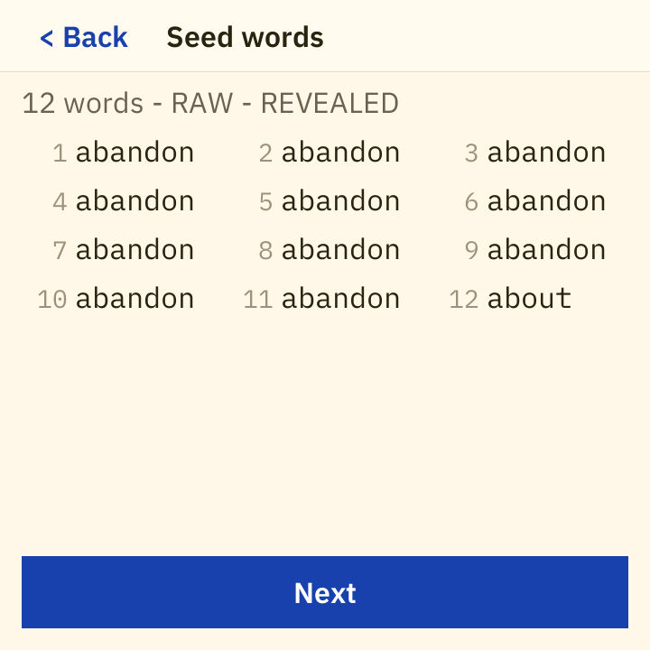

# notyas

An airgapped Bitcoin seed generator and verifier for ESP32-P4 touch-display boards.
Dice rolls in; BIP39 mnemonic and BIP32/44/48/49/84/86 public keys out, on a device
with no radio path, no storage of secrets, and a firmware hash you can read off the
screen.


---

## Status and safety - read this first 

**0.1.0 is a preview release for testing. Do not put real funds behind a seed
generated by this firmware.**

- No independent security audit has been performed on this code. None is claimed.
- The firmware has been exercised on exactly two boards (below). Everything else in
  the board table is a source-verified scaffold that has never run on hardware.
- Releases are **source only and unsigned**. There is no binary artifact to download
  and no signature to check, because shipping unsigned binaries for a Bitcoin wallet
  invites substitution attacks. Build it yourself from this tree.
- Reproducible-build tooling and signed releases are 0.2.0 work
  ([docs/plan-0.2.0/REPRODUCIBLE.md](docs/plan-0.2.0/REPRODUCIBLE.md)).
- The dev boards ship with Secure Boot and flash encryption **off**. The Verify
  screen reports their true state; it does not pretend they are on.

Use it against testnet, against published test vectors, and against a seed you are
prepared to throw away.

## What it is

notyas is [BigDice](https://github.com/intnsity/BigDice) - a desktop dice-to-seed
tool - ported to run standalone on an ESP32-P4 touch panel. You roll physical dice,
type the faces on the device, and the device turns them into a BIP39 mnemonic and the
public key material derived from it. Nothing is stored, nothing is transmitted, and
the same rolls always produce the same seed, so the result is checkable on any other
implementation.

What 0.1.0 does:

- Dice entry with a running effective-bits count and roll history, in six modes:
  RAW (variable-length prefix-free code) and fixed 12/15/18/21/24-word.
- BIP39 mnemonic display behind a two-step reveal gate, masked by default.
- Optional BIP39 passphrase, with an explicit opt-in, a Show/Hide toggle and an NFKD
  byte counter.
- BIP32/44/48/49/84/86 derivation: account xpub, SLIP-132 form where the scheme has
  one, and the first receive addresses.
- QR export of **public values only** - receive addresses and account xpub/SLIP-132.
  There is no QR, no serial, and no file path that emits a mnemonic, xprv, seed or
  WIF. That is a structural property of the UI crate, not a policy setting.
- Verify-existing-seed screen: type a mnemonic with BIP39 autocomplete and see its
  checksum verdict and derived keys.
- Verify-device screen: firmware version, board, IDF and silicon revision, SHA256 of
  the **running** app partition, source-id hash, boot self-test result, radio-kill pad
  readback, secure-boot and flash-encryption eFuse state - every field read at boot,
  never a compiled-in constant.
- A boot self-test of the crypto core that runs before any peripheral is initialized.

What 0.1.0 deliberately does **not** do: store a seed, sign anything, or touch a PSBT.
Those are 0.2.0 ([docs/plan-0.2.0/MILESTONES.md](docs/plan-0.2.0/MILESTONES.md)).

## Screens

| | | |
|---|---|---|
|  |  |  |
| Home, with the mainnet/testnet toggle | Dice entry: roll history, mode strip, effective bits | Mnemonic, masked by default |
|  |  |  |
| Two-step reveal gate | Revealed mnemonic | Optional BIP39 passphrase |
|  |  |  |
| Derived scheme: xpub, SLIP-132 zpub, addresses | QR of an account xpub - public values only | Verify device (simulator DUMMY values) |

These are rendered by the host simulator (`tools/uisim`) from the same
`crates/notyas-ui` code the device runs, at the 720x720 panel geometry, from published
test-vector input - 64 sixes and the passphrase `TREZOR`. Full index and the sample-data
provenance: [docs/screenshots/ui/README.md](docs/screenshots/ui/README.md). Photographs
of the physical devices are in [docs/photos/](docs/photos/README.md).

## Supported boards

Exactly one `board-*` cargo feature selects the hardware at compile time. There is no
runtime board detection: the build **is** the board. Rationale in
[docs/BOARDS.md](docs/BOARDS.md).

| Feature | Board | Display | Flash | Radio kill | Status |
|---|---|---|---|---|---|
| `board-waveshare-4b` | Waveshare ESP32-P4-WiFi6-Touch-LCD-4B | 720x720 MIPI-DSI (ST7703) | 32 MB | GPIO54 -> C6 EN | **Verified on hardware** |
| `board-elecrow-5` | Elecrow CrowPanel Advanced 5inch ESP32-P4 | 800x480 parallel RGB565 | 16 MB | GPIO20 -> C6 EN | **Verified on hardware** |
| `board-elecrow-7` | Elecrow CrowPanel Advanced 7inch | 1024x600 MIPI-DSI (EK79007) | 16 MB | GPIO32 -> C6 EN | Untested scaffold |
| `board-elecrow-9` | Elecrow CrowPanel Advanced 9inch | 1024x600 MIPI-DSI (EK79007) | 16 MB | GPIO32 -> C6 EN | Untested scaffold |
| `board-elecrow-101` | Elecrow CrowPanel Advanced 10.1inch | 1024x600 MIPI-DSI (EK79007) | 16 MB | GPIO32 -> C6 EN | Untested scaffold |
| `board-waveshare-7b` | Waveshare Touch-LCD-7B | 1024x600 MIPI-DSI (EK79007) | 32 MB | GPIO54 -> C6 EN | Untested scaffold |
| `board-waveshare-5` | Waveshare Touch-LCD-5 | 720x1280 MIPI-DSI (HX8394) | 32 MB | GPIO54 -> C6 EN | Untested scaffold, portrait layout unverified |
| `board-waveshare-7x` | Waveshare Touch-LCD-7 "X" | 720x1280 MIPI-DSI (ILI9881C) | 32 MB | GPIO54 -> C6 EN | Untested scaffold, portrait layout unverified |
| `board-waveshare-8x` | Waveshare Touch-LCD-8 "X" | 800x1280 MIPI-DSI (JD9365) | 32 MB | GPIO54 -> C6 EN | Untested scaffold, portrait layout unverified |
| `board-waveshare-101x` | Waveshare Touch-LCD-10.1 "X" | 800x1280 MIPI-DSI (JD9365) | 32 MB | GPIO54 -> C6 EN | Untested scaffold, portrait layout unverified |

"Untested scaffold" is a hard status, not a soft one: every constant traces to a
published vendor schematic or factory firmware, the module compiles, and that is the
entire claim. The module carries an UNTESTED banner, the firmware logs
`UNTESTED BOARD CONFIG` at boot, and `tools/build.ps1` warns. No hardware of that model
has ever run this code.

Board-specific caveats worth knowing before you buy: the **Elecrow** boards pull C6 EN
high through a 10K resistor, so the radio co-processor boots its factory firmware at
every power-up and runs for a few hundred milliseconds until `app_main` drives the kill
line low - a documented, unclosable-in-software window. The Elecrow 5inch also carries
a socket for LoRa/nRF24/Zigbee modules that must be physically empty, and an
unverifiable STC8 co-MCU on the touch I2C bus that the backlight requires. The
**Waveshare** boards have no pullup on C6 EN, so their radio is held down from
power-on. Details in [docs/SECURITY.md](docs/SECURITY.md) and
[docs/BOARDS.md](docs/BOARDS.md).

## Security model

[docs/SECURITY.md](docs/SECURITY.md) is normative and every claim there is meant to be
mechanically checkable. Summary of the six invariants:

1. **No radio.** The ESP32-C6 WiFi companion is held in reset by a P4 GPIO from the
   first line of `app_main`, permanently, with the kill pad a per-board compile-time
   constant. No `esp_hosted`, `esp_wifi_remote`, or any network/WiFi/BT component is in
   the image, and the SDIO link to the C6 is never configured. Enforced by a build-graph
   check over the dependency lockfiles (`tools/build-graph-check.sh`, run in CI), by the
   boot-time GPIO state, and by the Verify screen reporting the pad level it read.
2. **Stateless.** No seed, roll, passphrase or derived key is written to flash, NVS or
   SD. NVS is never mounted. RAM copies are zeroized when their screen is left, not
   merely dropped. Power-off is the wipe. There is no private-key export path of any
   kind in 0.1.0.
3. **Deterministic.** Key material derives exclusively from the dice you rolled or the
   mnemonic you typed, plus an optional passphrase. No TRNG, no clock, no OS entropy on
   any derivation path - `notyas-core` has no API for any of them, and the build-graph
   check fails if `rand`, `rand_core` or `getrandom` appears in its graph.
4. **Equivalence.** Identical input produces byte-identical output to desktop BigDice.
   Enforced by shared test vectors in CI and by the on-device boot self-test.
5. **Verifiable firmware.** The Verify screen shows the SHA256 of the running app
   partition, read from flash at boot rather than compiled in, plus the source-id hash,
   self-test verdict, and the secure-boot / flash-encryption eFuse bits as actually
   read. Reproducible builds and signed `SHA256SUMS.txt` are 0.2.0 work and are not
   claimed for 0.1.0.
6. **Secure boot, honestly.** Release hardware is intended to run Secure Boot v2
   RSA-3072 (P4 ROM ECDSA mode is broken - Espressif AR2026-006 - and is never used),
   flash encryption, and eFuse anti-rollback. The dev boards this was built on have all
   of that off, and the Verify screen says so.

**No secure element.** The ESP32-P4 has none, and notyas does not add one. There is no
tamper-resistant key storage on this device and no claim of any. That is survivable
precisely because the device stores nothing: it computes a seed, shows it to you, and
forgets it at power-off. Physical extraction from a running, powered device in an
attacker's hands is explicitly out of scope, as is supply-chain replacement of the
hardware itself.

Accepted risks are listed rather than hidden: ESP-IDF (FreeRTOS plus drivers) is a
large trusted computing base, USB is a live physical surface while connected, and the
panel and touch controllers run vendor init sequences. See the "Known accepted risks"
section of [docs/SECURITY.md](docs/SECURITY.md).

## Verification

**Boot self-test.** Before any peripheral is initialized, `notyas-core` runs six checks
and the firmware refuses to present a normal UI if any of them fails - it renders a
failure screen drawn without the crate under test. The checks are: BIP39 wordlist
integrity (count, sort order, spot glyphs, and the SHA-256 of the linked table against
the upstream `bip-0039/english.txt` digest), the RAW dice path against a captured
iancoleman vector, the FIXED dice path against a 36-sixes vector, PBKDF2-HMAC-SHA512
against Trezor BIP39 vector #1 with passphrase `TREZOR`, a BIP84 account xpub and first
receive address, and a BIP86 taproot address. On the bench both boards report
`6/6 passed` in about 494 ms.

**Firmware hash.** The Verify screen hashes the running app partition itself. You can
compare that value against the hash of the image you built and flashed, which is what
makes "is this the firmware I think it is" answerable on the device rather than on the
host that flashed it.

**Host tests.** `cargo test` at the release commit runs 133 tests across `notyas-core`
and `notyas-ui`, including the vector suites described below and the structural
assertions that no private value can reach a QR code.

## Provenance and cross-checking

notyas-core is a port of the desktop [BigDice](https://github.com/intnsity/BigDice)
crate (GPL-3.0-or-later) to `no_std`. The port changes `std::` imports to
`core::`/`alloc::`, replaces two `OnceLock`s with compile-time statics, and nothing
else in the math. Divergence from desktop BigDice output on identical input is treated
as a release-blocking bug.

The two dice modes cross-check against different external tools, on purpose:

- **RAW** uses a prefix-free variable-length base-6 code (a six maps to digit 0) and is
  byte-compatible with **iancoleman**'s BIP39 tool in dice/base-6 mode. It is therefore
  *not* compatible with Coldcard/SeedSigner dice math, and the UI labels this.
- **FIXED** takes SHA256 over the filtered digit string and the first ENT bits, which is
  algorithm-identical to **Coldcard** and **SeedSigner**.

Both are covered by committed vectors in `crates/notyas-core/tests/vectors/`:
official Trezor BIP39 vectors, vectors captured from real iancoleman JavaScript executed
under node, derivation vectors generated independently by Python `bip_utils`, and a
trimmed differential fuzz corpus whose expected values are the agreement of two
independent oracles. All of the sample data in this repository - screenshots included -
is published test-vector material. None of it is a real seed.

## Build and flash

The reference environment is Windows with PowerShell. The firmware needs the ESP-IDF
toolchain; the host crates need nothing but stable Rust.

Prerequisites (one-time):

```powershell
rustup toolchain install nightly-2026-07-27 --component rust-src
cargo install ldproxy espflash --locked   # espflash >= 4.5 for the P4
python -m pip install --user libclang     # libclang.dll for bindgen
```

`git` and `python` must be on PATH. `esp-idf-sys` downloads and manages ESP-IDF v5.5.4
and its toolchains itself on the first build (multi-GB, one-time).

Build and flash:

```powershell
tools\build.ps1 -Board waveshare-4b
tools\flash.ps1 -Board waveshare-4b -Monitor

tools\build.ps1 -Board elecrow-5
tools\flash.ps1 -Board elecrow-5 -Monitor
```

`-Board` drives the cargo feature, the sdkconfig pair, the per-board
`CARGO_TARGET_DIR`, the espflash `--flash-size`, and the default serial port. The
toolchain versions are pinned for reasons that are not cosmetic - a newer nightly and a
newer IDF both currently fail to build this target - and both boards are pre-v3.0
engineering-sample silicon needing a specific chip-revision config. **Read
[firmware/README.md](firmware/README.md) before your first build**; it documents the
exact versions, the revision trap, and fifteen pitfalls found the hard way.

Host-side work needs none of that:

```
cargo test                          # notyas-core, notyas-ui, host tools
cargo run --release -p uisim        # re-render docs/screenshots/ui/
bash tools/build-graph-check.sh     # SECURITY.md invariants 1 and 3
```

## Repository layout

```
crates/notyas-core     no_std crypto core: dice, BIP39, BIP32/44/48/49/84/86, QR symbols
crates/notyas-ui       no_std board-independent UI: screens, touch state machine, masking
crates/notyas-fonts    pre-rasterized glyph atlases + a minimal Rgb565 text renderer
firmware               std Rust on ESP-IDF: boards, display, touch, verify, main loop
tools/uisim            host simulator that renders every screen to PNG
tools/fonts            atlas generator and the upstream IBM Plex TTFs
docs                   architecture, security model, board designs, hardware notes
docs/plan-0.2.0        the 0.2.0 plan: storage, PSBT signing, reproducible builds
```

## Roadmap

0.2.0 is planned in detail rather than sketched. The reading order and the authority
rules between documents are in [docs/plan-0.2.0/INDEX.md](docs/plan-0.2.0/INDEX.md);
[docs/plan-0.2.0/MILESTONES.md](docs/plan-0.2.0/MILESTONES.md) is the single
dependency-ordered roadmap. The headline items are sealed on-device storage, PSBT
signing with an adversarial validation corpus, camera-based QR input, reproducible
builds with signed releases, and Secure Boot v2 on production hardware.
[docs/plan-0.2.0/PARITY.md](docs/plan-0.2.0/PARITY.md) is the honest feature matrix
against a Coldcard Mk4/Q.

## License

notyas is free software: you can redistribute it and/or modify it under the terms of
the **GNU General Public License, version 3 or later**. See [COPYING](COPYING) for the
full text. Every crate in this workspace declares `GPL-3.0-or-later`.

The embedded fonts are a separate matter: they derive from IBM Plex under the SIL Open
Font License 1.1 and are renamed to "notyas Sans" / "notyas Mono" because "Plex" is a
Reserved Font Name. [LICENSE-fonts](LICENSE-fonts) records the upstream releases, the
exact derivation, and the OFL text.

Third-party dependency licensing is summarized in
[docs/THIRD-PARTY.md](docs/THIRD-PARTY.md).
