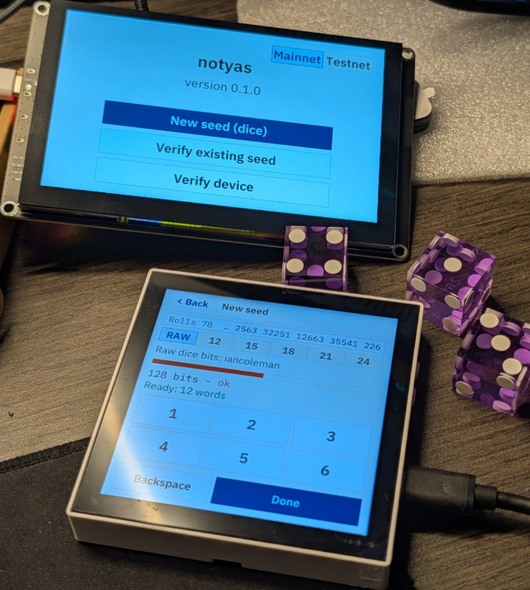

# notyas

An airgapped Bitcoin seed generator and verifier for the ESP32-P4.

Dice rolls in, BIP39 mnemonic and BIP32/44/48/49/84/86 keys out, on a device
with no radio path and verifiable firmware.



## What this is

notyas is [BigDice](https://github.com/intnsity/BigDice) ported to the
Waveshare ESP32-P4-WiFi6-Touch-LCD-4B. It is a stateless, airgapped seed
generator — dice entropy in, mnemonic words and derived keys out, QR codes
for public values (addresses, xpubs). No stored secrets, no radio, no TRNG.

## Hardware

- **Waveshare ESP32-P4-WiFi6-Touch-LCD-4B** — 720x720 MIPI-DSI, 32 MB flash, verified
- **Elecrow CrowPanel Advanced 5inch ESP32-P4** — 800x480 RGB, 16 MB flash, verified

Both boards carry an ESP32-C6 WiFi companion chip held in reset from boot.

## Security model

- **No radio.** The C6 is held in reset by a P4 GPIO from the first line of
  app_main. No WiFi/BT components in the firmware image.
- **Stateless.** Seeds live in RAM only, zeroized on screen exit and power-off.
  NVS is never mounted. No writes to flash at runtime.
- **Deterministic.** Key material derives exclusively from user-supplied dice
  rolls or typed mnemonic. No TRNG, no clock, no OS entropy.
- **Verifiable.** Reproducible build, signed releases, on-device Verify screen
  showing firmware SHA256, eFuse state, and boot self-test results.

See [docs/SECURITY.md](docs/SECURITY.md) for the full normative security model.

## Building

Requires Rust nightly, ESP-IDF v5.5, and PowerShell (Windows):

```
tools\build.ps1 -Board waveshare-4b
tools\flash.ps1 -Board waveshare-4b
```

## License

GPL-3.0-or-later. Fonts: IBM Plex (OFL 1.1), embedded as renamed atlases
("notyas Sans" / "notyas Mono") per the OFL Reserved Font Name clause.
