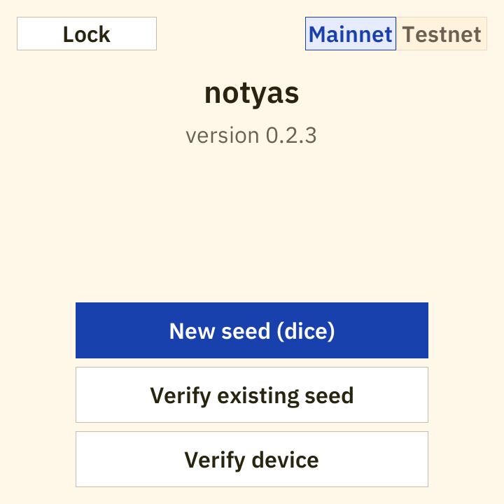
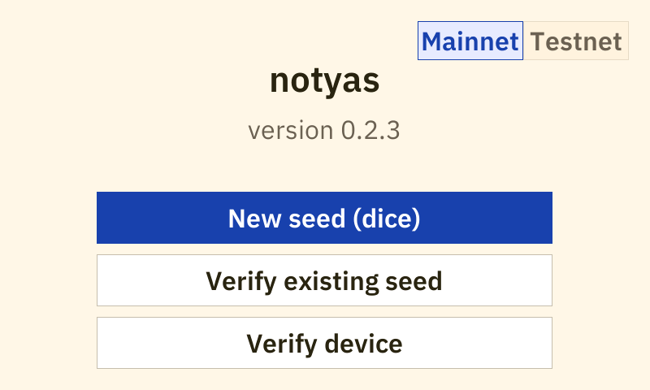

# Putting notyas on a board

Take a board out of its box, put notyas on it, and confirm that what is running is what the
project published. This page assumes you have never flashed a microcontroller before.

[docs/VERIFYING.md](VERIFYING.md) is the thorough version of section 3 below, and it goes
further than this page ever does: it rebuilds the firmware from source in a pinned container
and compares the result with the files you downloaded. Read this page first if flashing is
new to you, then read that one.

**Before you start.** This is preview firmware. Do not put real funds behind a seed it
generates. The README section "Status and safety" says why, and it is not boilerplate: there
is no Secure Boot, no flash encryption, no secure element, and no security audit.

---

## 1. What you need

**A board.** Two are verified on hardware, and the firmware is compiled separately for each
one:

| Board | Slug in the filename | Panel | Flash |
|---|---|---|---|
| Waveshare ESP32-P4-WiFi6-Touch-LCD-4B | `waveshare-4b` | 720x720 | 32 MB |
| Elecrow CrowPanel Advanced 5inch ESP32-P4 | `elecrow-5` | 800x480 | 16 MB |

The build **is** the board. There is no runtime detection, the display driver and the flash
size are compiled in, and the image for one board will not run correctly on the other. Eight
further boards have source modules in this repository that have never run on hardware
([docs/BOARDS.md](BOARDS.md)); no release image is published for them.

**A USB-C cable that carries data.** Many cables sold with phones and battery packs carry
power only. A charge-only cable is the single most common reason a board never appears on the
computer.

**The release files**, from https://github.com/intnsity/notyas/releases. Per board, using
0.2.3 as the example version:

```
notyas-0.2.3-waveshare-4b-merged.bin           the one you flash: the three below, in one file
notyas-0.2.3-waveshare-4b-bootloader.bin       second stage bootloader, belongs at 0x2000
notyas-0.2.3-waveshare-4b-partition-table.bin  the flash layout, belongs at 0x8000
notyas-0.2.3-waveshare-4b-app.bin              the application itself, belongs at 0x10000
notyas-0.2.3-waveshare-4b-sdkconfig.txt        the exact build configuration used
notyas-0.2.3-waveshare-4b-BUILDINFO.txt        toolchain versions, input hashes, environment
notyas-0.2.3-waveshare-4b-VERIFY.json          the numbers the device's Verify screen shows
notyas-0.2.3-waveshare-4b.elf                  unstripped binary, for diagnosing a failed rebuild
```

and, once for the whole release, `notyas-0.2.3-src.tar.gz`, `notyas-0.2.3-components.tar.gz`,
`SHA256SUMS.txt` and `SHA256SUMS.txt.asc`. `SHA256SUMS.txt` is the authority on the exact set
a given release page carries. Substitute the version you actually downloaded, and the slug of
the board you actually have, in every command on this page.

**A computer** running Windows, macOS or Linux. Nothing here needs administrator rights
except installing the tools.

---

## 2. Easy mode: the flash tool

`flashtool/` in this repository is a Windows program that checks the signature and the hashes
of a downloaded release and then flashes the board, so the checking and the flashing are one
sitting rather than two. It is the shortest path, and its cost is stated here rather than
discovered halfway down.

### What has to be installed first

Four things. The first three have to be in place before you launch it; the fourth is how you
get the program at all.

- **GnuPG**, for the signature check. On Windows that is Gpg4win,
  https://gpg4win.org/download.html.
- **Python**, https://www.python.org/downloads/. Tick **Add python.exe to PATH** in the
  installer; the tool cannot find it otherwise.
- **esptool**, which does the actual writing. Once Python is installed, open PowerShell and
  run `pip install esptool`. Version 5.x is what this project's documentation is written
  against.
- **Rust**, https://rustup.rs, because the tool is not published as a program you can
  download. See the next heading.

The tool probes for GnuPG and esptool **once, at startup**, and leaves its Start button
disabled if either is missing. There is no re-check button, so install everything first, and
if you install something after launching it, close it and open it again.

### What this tool is, and what has never happened to it

Stated plainly, because it changes how much you should lean on it:

- **It is not published as a program you can download.** Nothing in the release and nothing
  in CI builds it. You build it yourself:

  ```powershell
  git clone https://github.com/intnsity/notyas
  cd notyas\flashtool
  cargo build --release
  ```

  The result is `notyas\flashtool\target\release\notyas-flashtool.exe`, about 4 MB. That
  command succeeds on a clean checkout as of 2026-08-23: it was run, and it produced the
  binary.

- **It has never been run against a real release.** Until 0.2.3 no notyas release had any
  files to check, so there was nothing to point it at. Everything below about its behaviour
  comes from reading `flashtool/src/`, not from watching it work.

- **It is written for Windows.** Its fallback search is for `gpg.exe` in the Gpg4win install
  locations, and it talks about COM ports. On macOS or Linux, use section 4.

If you would rather not install Rust to get a wrapper around a handful of commands, skip to
sections 3 and 4. They are the commands it runs for you.

### Clicking through it

1. **Start.** The first screen lists the two prerequisites it probed for and enables Start
   only if both were found.
2. **Select release folder.** Point it at the folder holding your downloads. It reports
   whether `SHA256SUMS.txt` and `SHA256SUMS.txt.asc` are there.
3. **Verify signature.** It imports the release public key, which is compiled into the program
   from `docs/keys/` in this repository, then runs GnuPG and requires a `VALIDSIG` line
   carrying the fingerprint `A1E953B25C6A623B77A1D5223AC4BBCFE51AB37D`. That is the right
   check, and it is the one section 3 has you make by hand. Note where the key came from: one
   source, this repository. Section 3 asks you to compare that fingerprint against two.
4. **Verify file hashes.** It hashes every file `SHA256SUMS.txt` names and requires all of
   them to match.
5. **Continue to Flash**, which stays disabled until both checks have passed.
6. **Refresh ports**, then pick the COM port your board appeared on.
7. **Select merged.bin**, then **Flash**. Do not unplug while it runs.

### Three things to steer around

- **Download the whole release, not just your board's files.** The hash step requires every
  file listed in `SHA256SUMS.txt` to be present in the folder. A file you never downloaded
  counts as a failure rather than being skipped, and one failure disables the Continue button.
  The by-hand check in section 3 does not work this way.
- **Do not use the "Use verified file" button.** It picks the first file in the folder whose
  name contains `merged.bin`, with no idea which board you own. With both boards' artifacts in
  one folder that is the Elecrow image, whatever board is on your desk. Use **Select
  merged.bin** instead and pick the filename carrying your board's slug.
- **The Flash step accepts any `.bin` you point it at**, including one that was never checked.
  Verifying and flashing are two separate choices inside the program, and only you connect
  them.

Two smaller notes. Its final screen says the Verify device screen appears on boot; it does
not. A freshly flashed board opens on Home, and `Verify device` is the third button there.
And its signature check looks for the `VALIDSIG` line without also checking for the
`REVKEYSIG` and `EXPKEYSIG` lines GnuPG prints beside it when a key has been revoked or has
expired, so it would accept a signature from a retired release key. The command for that is at
the end of section 3.

---

## 3. Checking the files

Two separate questions, and you want both answered before anything is written to a board.

**The hashes answer "are these the bytes that were published".** A SHA-256 hash is a short
fingerprint computed from a file's contents, and changing one byte anywhere changes it
completely. `SHA256SUMS.txt` lists the hash the project computed for each file, so if your
copy hashes to the same value, your copy is identical to theirs.

**The signature answers "who published them".** `SHA256SUMS.txt.asc` is a signature over
`SHA256SUMS.txt`, made with a private key only the release holder has. Checking it tells you
that the list of hashes was written by whoever holds that key, which is what turns "these
bytes were not damaged in transit" into "these bytes came from this project".

The hashes alone prove nothing about origin: anyone who can replace the files can replace the
list beside them. That is why the signature exists, and why it is over the list rather than
over each file, since the list already covers each file.

### Get the release key

```sh
gpg --keyserver keys.openpgp.org --recv-keys A1E953B25C6A623B77A1D5223AC4BBCFE51AB37D
```

The fingerprint is

```
A1E9 53B2 5C6A 623B 77A1 D522 3AC4 BBCF E51A B37D
```

and you should compare all forty digits against at least two independent sources: the key
server above, `docs/keys/` in this repository, and the maintainer's GitHub profile. A key
server hands out whatever was uploaded under a given name, so the fingerprint is the check,
not the search result.

### Check the hashes

Linux:

```sh
sha256sum -c SHA256SUMS.txt --ignore-missing
```

macOS. `shasum` is a different program from GNU `sha256sum` and has no `--ignore-missing`, so
give it only the lines for the files you downloaded:

```sh
ls > have.txt
grep -F -f have.txt SHA256SUMS.txt > mine.txt
shasum -a 256 -c mine.txt
```

Windows PowerShell, one file at a time. Set `$name` to the file you want to check:

```powershell
$name = "notyas-0.2.3-waveshare-4b-merged.bin"
$want = (Get-Content .\SHA256SUMS.txt | Where-Object { $_.EndsWith($name) }) -split '\s+' |
        Select-Object -First 1
$got  = (Get-FileHash ".\$name" -Algorithm SHA256).Hash
if ($want -and $got -ieq $want) { "OK  $name" } else { "MISMATCH - do not flash" }
```

Every file must say OK. A mismatch is far more often a download that stopped early than an
attack: fetch the file again before concluding anything.

### Check the signature, and the trap in it

**`gpg --verify` exits 0 for a good signature from any key in your keyring, and prints
`Good signature from "intnsity <at@intnsity.com>"` for any key carrying that name.** That name
is a text field whoever made the key typed into it. Someone can make a key this afternoon, put
that name on it, sign their own files with it, and your terminal prints the same sentence and
the same exit code. **"It said OK" is not the check.** The check is that the signature was made
by the fingerprint above, and the only place GnuPG states the fingerprint of the key that made
a signature is its machine-readable status output.

So ask it that question directly. Linux and macOS:

```sh
gpg --status-fd 1 --verify SHA256SUMS.txt.asc SHA256SUMS.txt \
  | grep "^\[GNUPG:\] VALIDSIG .*A1E953B25C6A623B77A1D5223AC4BBCFE51AB37D"
```

Windows PowerShell:

```powershell
$s = gpg --status-fd 1 --verify .\SHA256SUMS.txt.asc .\SHA256SUMS.txt
if ($s -match 'VALIDSIG .*A1E953B25C6A623B77A1D5223AC4BBCFE51AB37D') {
    "signed by the notyas release key"
} else {
    "NOT the notyas release key - do not flash"
}
```

On Linux and macOS, one line of output means the release key made the signature and **no
output means it did not**, whatever name GnuPG printed above it. On Windows you get one of the
two messages.

You will also see `WARNING: This key is not certified with a trusted signature`. That is normal
and expected. It means you have not personally signed this key in your own web of trust; it
does not mean anything is wrong.

One more line to look for. GnuPG prints `VALIDSIG` and exits 0 even for a key that has been
revoked or has expired, alongside a separate line saying so. For a release key those are
refusals:

```sh
gpg --status-fd 1 --verify SHA256SUMS.txt.asc SHA256SUMS.txt \
  | grep -E "^\[GNUPG:\] (BADSIG|ERRSIG|EXPSIG|EXPKEYSIG|REVKEYSIG)"
```

**No output is what you want here**, the opposite of the check above.

### If the fingerprint does not match

**Stop, and do not flash anything from that download.** Do not try a different cable, a
different tool or a second attempt: those fix a broken download, and this is not one. A
signature that verifies under some other fingerprint is a claim that somebody other than the
release holder produced these files. Report it at https://github.com/intnsity/notyas/issues
with the exact fingerprint you saw.

[docs/VERIFYING.md](VERIFYING.md) section 4 is this material at greater depth, and its
section 9 covers what to do about every other kind of mismatch.

---

## 4. Manual mode: the esptool command

This is what the flash tool runs on your behalf, and it is the path on macOS and Linux.

**Install esptool.** `pip install esptool`. On current Linux distributions `pip` into the
system Python is refused with `error: externally-managed-environment`, which is the
distribution protecting its own packages rather than anything to do with this project. Use
`pipx install esptool` or a virtual environment; docs/VERIFYING.md section 2 has the exact
commands.

**Find the port.** Windows: `COM3`, `COM6` or similar, listed under Ports (COM & LPT) in
Device Manager. Linux: `/dev/ttyUSB0` or `/dev/ttyACM0`. macOS: `/dev/cu.usbserial-*`. The
reliable method on any of them is to list the ports with the board unplugged, plug it in, and
list again; the one that appeared is your board.

**Flash it**, substituting your port and your board's filename:

```sh
esptool --chip esp32p4 -p COM3 -b 921600 write-flash 0x0 \
        notyas-0.2.3-waveshare-4b-merged.bin
```

`-b 921600` is the speed. Leave it out and the default of 115200 writes the same image
correctly and takes several minutes rather than well under one; if the fast speed fails
partway through, drop the flag and try again.

That is the whole of it. Unplug the cable and plug it back in when it finishes.

**Why one command is enough.** A notyas image is three separate pieces, which normally means
three writes at three addresses:

```sh
esptool --chip esp32p4 -p COM3 write-flash \
    0x2000  notyas-0.2.3-waveshare-4b-bootloader.bin \
    0x8000  notyas-0.2.3-waveshare-4b-partition-table.bin \
    0x10000 notyas-0.2.3-waveshare-4b-app.bin
```

`merged.bin` is those three pieces already laid out at those offsets with the gaps between
them filled, which is why it is written as a single image starting at address `0x0`. The
release build produces it with `esptool merge-bin`, then extracts each region back out of the
result and compares it byte for byte against the file it came from, so the merged image is
provably its three parts plus padding rather than whatever a tool decided to emit
(`tools/repro/build.sh`). Both forms above install the same firmware.

`write-flash` is the esptool 5.x spelling. Version 4.x spelled it `write_flash`, and 5.x still
accepts that spelling with a deprecation warning.

**Flashing does not create a wallet and does not erase one.** The device ships with no wallet,
and making one is something you do on the panel afterwards. On a board that already holds a
sealed wallet this writes nothing that reaches it: `merged.bin` ends inside the application
partition, and the `wallets`, `counters` and `settings` regions begin at `0x410000`, past its
end. Upgrading a board that carries an older partition table is
[docs/archive/SETTINGS-MIGRATION.md](archive/SETTINGS-MIGRATION.md).

---

## 5. First boot, and where the device takes you

esptool resets the board when it finishes writing. If the panel stays dark, unplug the cable
and plug it back in: a power cycle is a different reset path from the one esptool drives.

Before the display comes up, the firmware runs eleven self-tests over its crypto core and
refuses to present a normal screen if any of them fails. Then Home appears: the name, the
version, a Mainnet/Testnet toggle in the top right, and three buttons.

**`Verify device`** is the third button, and it is worth pressing first. It reports the
firmware version and board, the digests of the app image, bootloader and partition table, the
eFuse state, the chip and flash identity, the radio kill line and the self-test verdict. Every
value is read at boot rather than compiled in.



Those are the same numbers as in the `VERIFY.json` you downloaded, which is covered by the
signature you checked in section 3, so you can compare the chip in your hand against the
release. [docs/VERIFYING.md](VERIFYING.md) section 8 has the tool that does that comparison
and explains the one number that confuses everybody. What this screen cannot do is prove the
firmware is genuine: with no Secure Boot, it is the running firmware reporting on itself.

**`New seed (dice)`** is where a wallet starts. You roll physical dice and the device counts
the entropy you have actually supplied.



Use testnet, and a seed you are prepared to throw away.

Three things to know about where this goes next:

- **The board cannot save anything until it is provisioned.** A freshly flashed board derives
  keys and shows addresses, but storing a wallet needs one eFuse key block burned, once per
  device, from the host, and that burn cannot be undone.
  [docs/PROVISIONING.md](PROVISIONING.md) is the whole procedure and it should be read before
  anything is run. Signing needs it too: the device only signs with a wallet it unsealed from
  storage.
- **Transactions arrive on a microSD card**, not over the cable. On the Waveshare 4B in its
  factory chassis the card slot sits behind the backing plate and cannot be reached, so that
  board cannot receive a transaction until the plate is replaced.
  [docs/BOARDS.md](BOARDS.md) records this.
- **Hand your wallet software the descriptor from the Export tab, not the bare xpub below
  it.** The README section "Setting up a coordinator" explains why that difference matters.

---

## 6. When it goes wrong

**No COM port appears, or the tool finds no board.**

- Try the other USB-C port. The Waveshare 4B has two: the one labelled `USB UART` carries the
  CH343 serial bridge and is the one these commands expect, and the one labelled `USB` is the
  chip's own USB pins.
- Try another cable. Charge-only cables are common and look identical to data ones.
- Install the USB-serial driver. The Waveshare uses a CH343 bridge and the Elecrow a CH340K,
  both WCH parts, and WCH publishes the drivers on its own download pages. Windows does not
  always have one already.
- Close anything else holding the port: a serial monitor, an IDE, an earlier esptool run.

**esptool waits, then says it failed to connect.** Almost always the wrong port: it opened
something that is not the board and got no answer. List the ports with the board unplugged,
plug it in, list again, and use the one that appeared. If the right port still does not answer,
put the board into download mode by hand: hold BOOT down, tap RESET, release BOOT, then run the
command again.

**A hash does not match.** Download that file again, ideally over a different network. A
truncated download is far more likely than an attack. If it fails a second time, report it
rather than flashing it.

**The flash tool reports failures for files you never downloaded.** It requires every file
named in `SHA256SUMS.txt` to be present. Download the rest of the release, or check by hand
with section 3.

**The signature check did not name the release key.** Then the signature was not made by it.
Stop, do not flash, and report it with the fingerprint you saw. This one is not a retry.

**It flashed, and the screen stays dark.** Check the filename you flashed against the board in
front of you: the display driver and the flash size are compiled in, so the other board's image
will not bring the panel up. Power-cycle rather than reset. And flash `merged.bin` rather than
`app.bin` on its own, because a board that has never run this firmware also needs the
bootloader and partition table that `merged.bin` carries with it.
